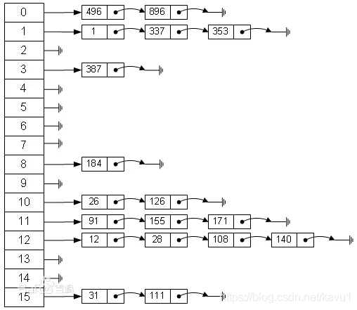

# JDK1.8 HashMap 底层数据结构

* 引自：https://blog.csdn.net/kavu1/article/details/84098449?utm_medium=distribute.pc_relevant.none-task-blog-baidujs_baidulandingword-0&spm=1001.2101.3001.4242

* JDK1.8 中引入了红黑树（查找时间复杂度为O(logn),用数组+链表+红黑树的结构来优化这个问题）
* HashMap 最常见的实现方法是 **拉链法--即一系列链表为数组元素组成的数组**
    
* 从上图我们可以看到，HashMap由 链表 + 数组 组成，他的 底层结构是一个数组，而数组的元素是一个单向链表。图中是一个长度为16位的数组，每个数组存储的元素代表的是每一个链表的头节点
* 好的Hash算法可以计算出几乎独一无二的HashCode，如果出现了重复的HashCode，就称作碰撞，就算是MD5这样优秀的算法也会发生碰撞，即两个不同的key也有可能生成相同的MD5
* 正常情况下，我们通过hash算法，往hashMap的数组中插入元素。如果发生了碰撞事件，那么意味着数组的一个位置要插入两个或者多个元素，这个时候数组上面挂的链表起作用了，链表会将数组某个节点上多出的元素按照尾插法（JDK1.7及以前为头插法）的方式添加

## HashMap的内部实现机制

#### HashMap基本元素

```java
public class HashMap<K,V> extends AbstractMap<K,V>
    implements Map<K,V>, Cloneable, Serializable {
	/**
     * 默认初始容量为16，这里这个数组的容量必须为2的n次幂.
     */
    static final int DEFAULT_INITIAL_CAPACITY = 1 << 4; // aka 16
    
    
}
```

