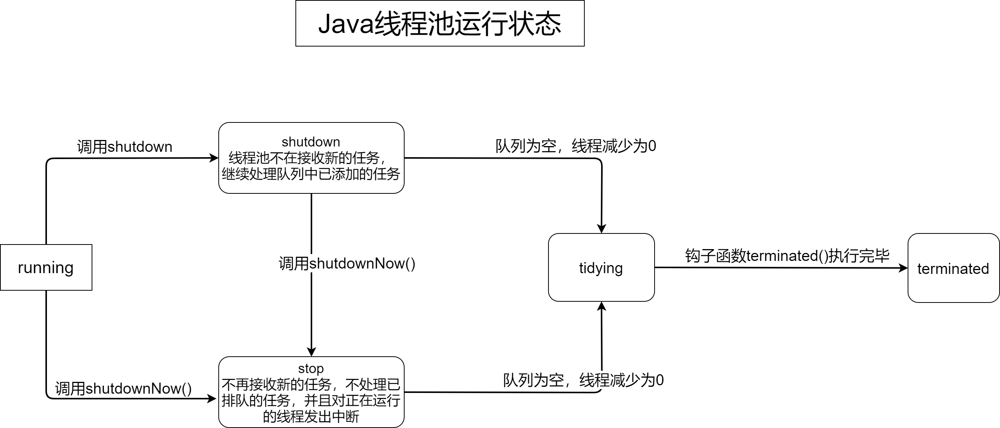

# JDK1.8 线程池源码分析
## 线程池的状态
* 线程池内部使用 AtomicInteger 类型的ctl属性来进行状态控制。其中次高三位分别表示running、shutdown、stop、teminated这5中状态

## JAVA线程池
* java线程池（ThreadPoolExecutor）大致的一个类图
  

* 可以看到 ThreadPoolExecutor的父接口有Executor和ExecutorService，其中ExecutorService是对Executor接口的扩展，AbstractExecutorService是ThreadPoolExecutor父类，这个类中也实现了一些非常中药的方法。需要重点分析的还是ThreadPoolExecutorService，我们通常使用如下代码来创建java线程池

* ```java
          ThreadPoolExecutor threadPool = new ThreadPoolExecutor(
                  5,
                  8,
                  15,
                   TimeUnit.SECONDS,
                  new LinkedBlockingQueue<>(10),
                  Executors.defaultThreadFactory(),
                  new ThreadPoolExecutor.DiscardOldestPolicy());
  ```


### Executor接口

* 先来看一下顶层接口Executor

* ```java
  public interface Executor {
  
      /**
       * Executes the given command at some time in the future.  The command
       * may execute in a new thread, in a pooled thread, or in the calling
       * thread, at the discretion of the {@code Executor} implementation.
       *
       * @param command the runnable task
       * @throws RejectedExecutionException if this task cannot be
       * accepted for execution
       * @throws NullPointerException if command is null
       */
      void execute(Runnable command);
  }
  ```

* Executor接口里面只有一个execute(Runnable command)抽象方法，是java线程池最核心的方法。返回类型是void，这个方法入参是一个runnable的实例，代表提交一个任务

### ExecutorService接口

* ExecutorService是对Executor接口的扩展，这个接口中提供了更加丰富的功能。我们常用的也是这个接口

* ```java
  
  ```

* 