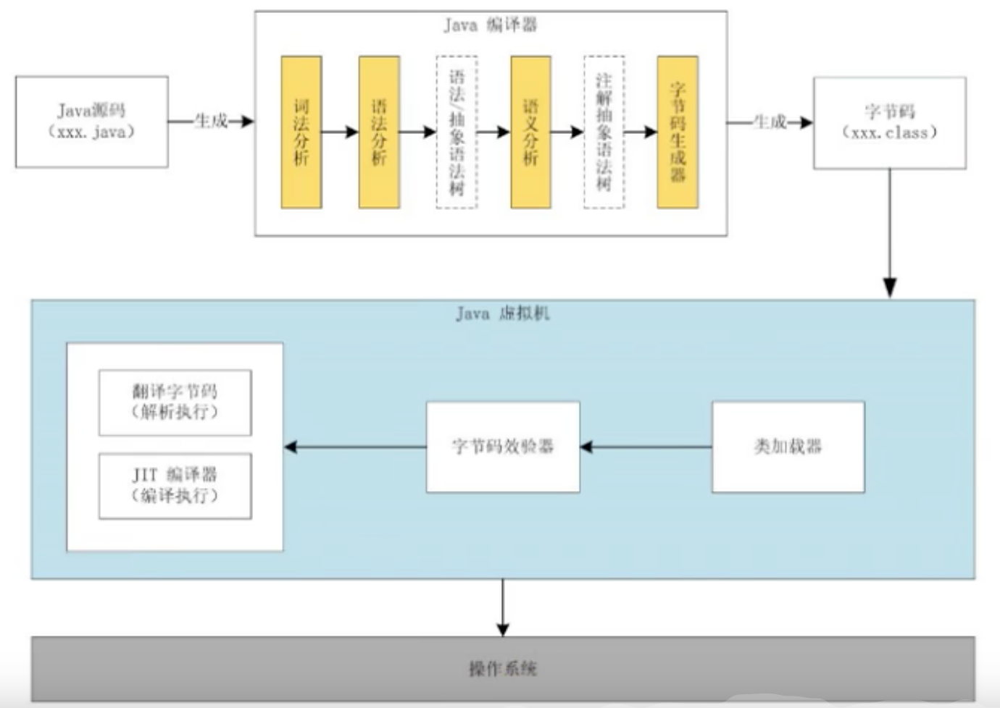

# JVM 相关知识学习
* 理论 > 代码
* 通俗、易懂、说人话
* 图解

## 相关参考书目
* 官方文档  英文，看不懂  oracle官网下载
* java 虚拟机规范（Java SE 8版） （不建议，适合查阅，但不适合学习）
* 周志明  深入理解java虚拟机
*

## Java及JVM简介
* TIOBE语言热度排行榜
### java：跨平台语言
* write once, run anywhere.
* JVM 跨语言的平台

### 如何正真搞懂JVM
* 相关书籍：自己动手写Java虚拟机 (张秀宏)

### 虚拟机
* 就是一个虚拟的计算机。它是一款软件，用来执行一系列虚拟计算机指令。
* java 虚拟机是一台执行java字节码的虚拟计算机，它拥有独立的运行机制，其运行的java字节码也未必由java语言编译而成
* 特点：
    * 一次编译，到处运行
    * 自动内存管理
    * 自动垃圾回收功能

### JVM的整体结构(需要掌握，并能手绘出来)  HotSpot VM 虚拟机

### Java代码的执行流程
* Java程序 进行编译生成字节码文件，字节码文件然后在JVM虚拟机上进行执行
* 