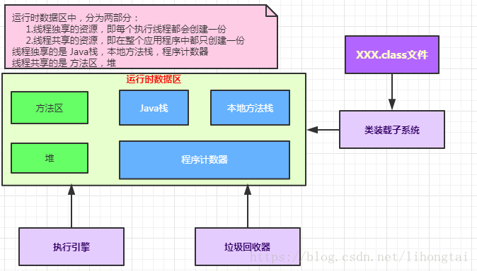
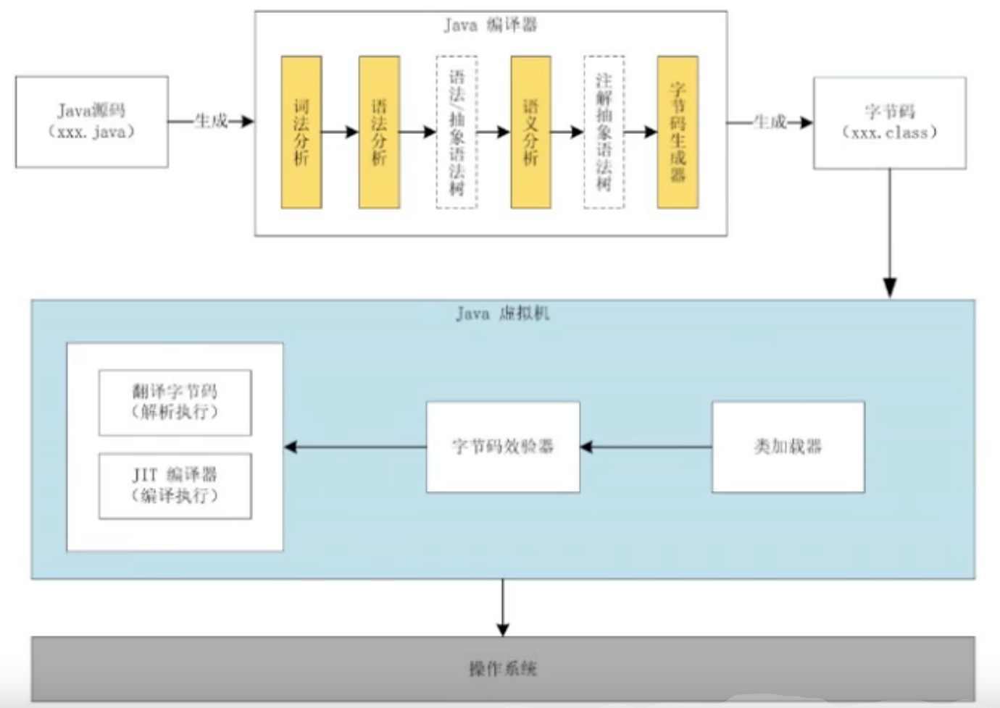

# JVM 相关知识学习
* 理论 > 代码
* 通俗、易懂、说人话
* 图解

## 相关参考书目
* 官方文档  英文，看不懂  oracle官网下载
* java 虚拟机规范（Java SE 8版） （不建议，适合查阅，但不适合学习）
* 周志明  深入理解java虚拟机
*

## Java及JVM简介
* TIOBE语言热度排行榜
### java：跨平台语言
* write once, run anywhere.
* JVM 跨语言的平台

### 如何正真搞懂JVM
* 相关书籍：自己动手写Java虚拟机 (张秀宏)

### 虚拟机
* 就是一个虚拟的计算机。它是一款软件，用来执行一系列虚拟计算机指令。
* java 虚拟机是一台执行java字节码的虚拟计算机，它拥有独立的运行机制，其运行的java字节码也未必由java语言编译而成
* 特点：
    * 一次编译，到处运行
    * 自动内存管理
    * 自动垃圾回收功能

### JVM的整体结构(需要掌握，并能手绘出来)  HotSpot VM 虚拟机

### Java代码的执行流程
* Java程序 进行编译生成字节码文件，字节码文件然后在JVM虚拟机上进行执行
* 

### JVM的架构模型

* java编译器输入的指令流基本上是一种基于栈的指令集架构，另外一种指令集架构则是基于 寄存器的指令集架构
* 具体来说：这两种架构之间的区别
* **基于栈式架构的特点**
  * 实际和实现更简单，适用于资源受限的系统；（如机顶盒，路由器等小型设备）
  * 避开了寄存器的分配难题：使用零地址指令方式分配
  * 指令流中的指令大部分是零地址指令，其执行过程依赖于操作栈。指令集更小，编译器容易实现
  * 不需要硬件支持，可移植性更好，更好的实现跨平台

* 由于跨平台性的设计，Java的指令集都是根据栈来设计的。不同平台的CPU架构不同，所以不能设计为基于寄存器的。
* 优点：是跨平台，指令集小，编译器容易实现
* 缺点：性能下降，实现相同的功能需要更多的指令

### JVM的生命周期

* **虚拟机的启动**
  * Java虚拟机的启动是通过引导类加载器（Bootstarp class loader）创建一个初始类（initial class）来完成的，这个类是由虚拟的具体实现指定的。
* **虚拟机的执行**
  * 一个运行中的Java虚拟机有着一个清晰的任务：执行Java程序。
  * 程序开始执行时他才运行，程序结束时他就停止
  * 执行一个所谓的Java程序的时候，真真正正在执行的是一个叫做Java虚拟机的进程。
* **虚拟机的推出**
  * 程序正常结束
  * 程序在执行过程中遇到了异常或错误而异常终止
  * 由于操作系统出现错误而导致Java虚拟机进程终止
  * 某线程调用RunTime类或者System 类的exit方法，或RunTime类的halt方法，并且Java安全管理器也允许这次exit或halt操作
  * 